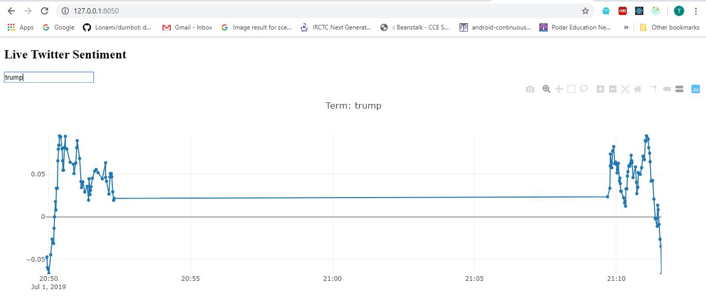

## Real time Twitter sentiment analysis

### Here we carry a real time twitter sentiment analysis .
Fir this we need twitter api keys which we can get from twitter developers account which is absolutely free  
https://developer.twitter.com/

Make a new file keys.txt in same directory and run python senti5.py to get output  
Also we have a textbox which gives output of twitter sentiment analysis of the word written

